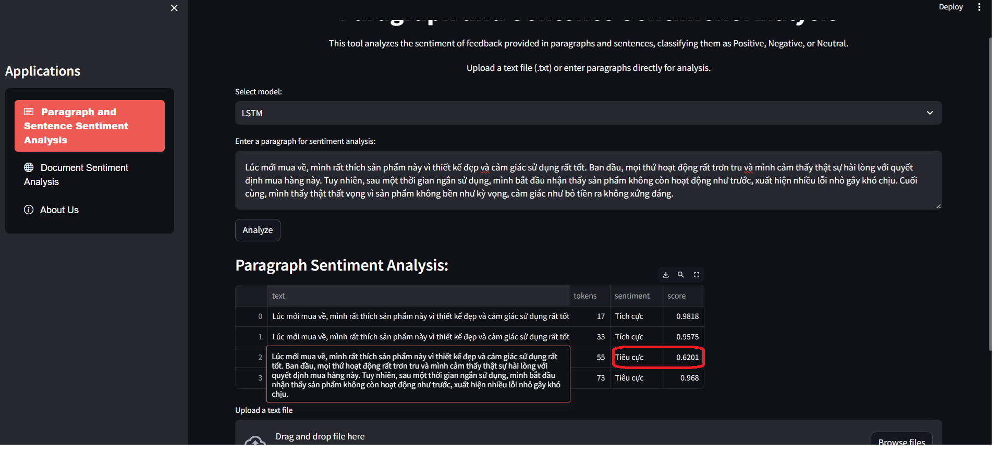

# Đồ án cuối kì - Xử lý Ngôn ngữ Tự nhiên Nâng cao - HCMUS


# Xây dựng các API và demo đánh giá ý kiến người dùng cho văn bản tiếng Việt

## Giới thiệu

Dự án này tập trung vào việc xây dựng các API và tạo các demo cho phân tích cảm xúc trên phản hồi tiếng Việt.


## Thành viên nhóm

| MSSV            | Họ và tên            |
|-----------------|----------------------|
| 21127050        | Trần Nguyên Huân     |
| 21127131        | Trần Hải Phát        |
| 21127240        | Nguyễn Phát Đạt      |

## Kiến trúc của dự án

Sơ đồ quy trình giao tiếp giữa Client, Streamlit, FastAPI, và Model:


## Hướng dẫn cài đặt
### Cách 1: Sử dụng docker 
1. **Clone repository này và chạy lệnh Docker sau:**

1. Để khởi động ứng dụng, chạy lệnh:

   ```bash
   docker-compose up -d --build

2. Truy cập ứng dụng:
   Mở trình duyệt và điều hướng đến [http://localhost:8501/](http://localhost:8501/).

3. Để dừng ứng dụng, chạy lệnh:
   ```bash
   docker-compose down
   Hoặc, nếu bạn đang chạy Docker Compose từ terminal, bạn có thể dừng ứng dụng bằng tổ hợp phím Ctrl + C.
### Cách 2: Không sử dụng Docker
1. Cài đặt các gói phụ thuộc từ file requirements.txt trong hai thư mục `src/gui` và `src/api`:
    ```
    pip install -r src/gui/requirements.txt
    pip install -r src/api/requirements.txt
    ```
2. Chạy lệnh sau để khởi động ứng dụng:
    ```
    python run.py
    ```
## Hướng dẫn sử dụng

### Tab 1: Phân tích theo câu 
Ứng dụng hỗ trợ phân tích cảm xúc theo từng câu nối tiếp nhau hoặc từng câu riêng lẻ.
#### **Phân tích chuyển tiếp các câu liên tục**
1. **Chọn model phân tích:**
   Chọn model bạn muốn sử dụng để phân tích từ danh sách có sẵn.
   
2. **Nhập đoạn text và phân tích:**
   - Nhập đoạn text bạn muốn phân tích vào ô nhập liệu.
   - Bấm vào nút "Analyze" để bắt đầu phân tích.
   
3. **Kết quả phân tích:**
   <div style="display: flex;">
   
   
   </div>

   **Nhận xét:** Mô hình đã nhận diện tốt sự chuyển tiếp cảm xúc trong đoạn văn. Ví dụ, câu đầu tiên được phân loại là tích cực với điểm số cao 0.9575, thể hiện sự hài lòng rõ ràng. Tuy nhiên, ở câu tiếp theo, cảm xúc tiêu cực với điểm số 0.6201 được phát hiện khi sản phẩm bắt đầu gặp vấn đề, chứng tỏ mô hình có khả năng phân tích và phản ánh sự thay đổi cảm xúc hiệu quả.
#### **Phân tích theo từng câu và thống kê cảm xúc cho scopus**
Chức năng này cho phép bạn phân tích cảm xúc từng câu trong một tài liệu Scopus.
1. **Đầu tiên, bạn cần tải lên file văn bản (.txt) chứa nội dung Scopus mà bạn muốn phân tích.**
2. **Sau khi xử lý, kết quả sẽ hiển thị phân tích cảm xúc cho từng câu trong tài liệu ở bên trái, cùng với biểu đồ tròn minh họa tỷ lệ các nhãn cảm xúc: Tiêu cực, Trung tính và Tích cực.**


### Tab 2: Phân tích theo document
Ở phần này ứng dụng tập trung hỗ trợ phân tích cho toàn bộ document và trả ra số điểm (tỉ lệ) cho từng cảm xúc mà mô hình dự đoán cho document tương ứng. 

Các bước thực hiện cũng tương tự như với tab 1:
1. **Chọn model phân tích.**
2. **Nhập text trực tiếp hoặc upload file txt document.**
3. **Bấm vào nút "Analyze" để bắt đầu phân tích.**
4. **Kết quả trả về sẽ trả ra nhãn có tỉ lệ dự đoán cao nhất, và thống kê tỉ lệ từng nhãn mà mô hình dự đoán được**


### Tab 3: Thông tin nhóm 
Ngoài ra, nếu muốn biết thêm thông tin của nhóm có thể chuyển sang tab `About Us` 
